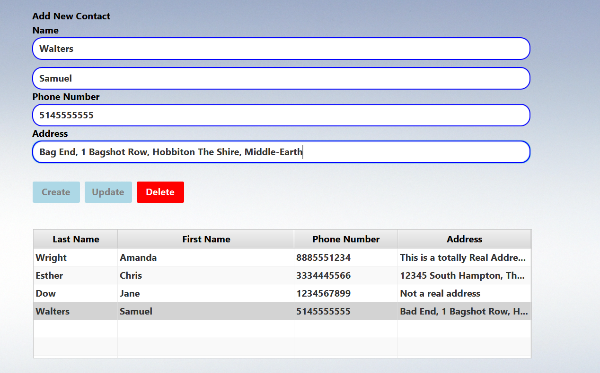
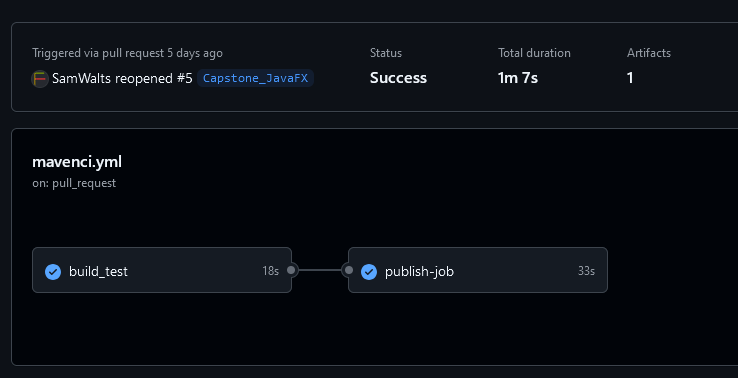
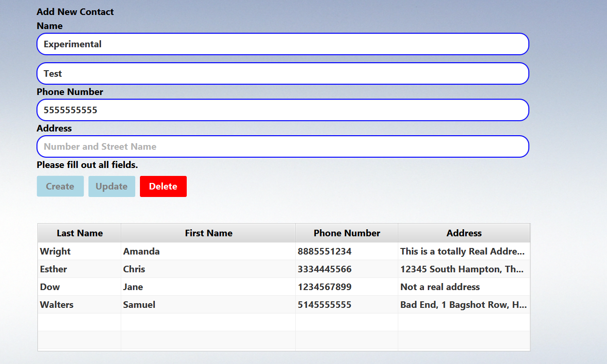
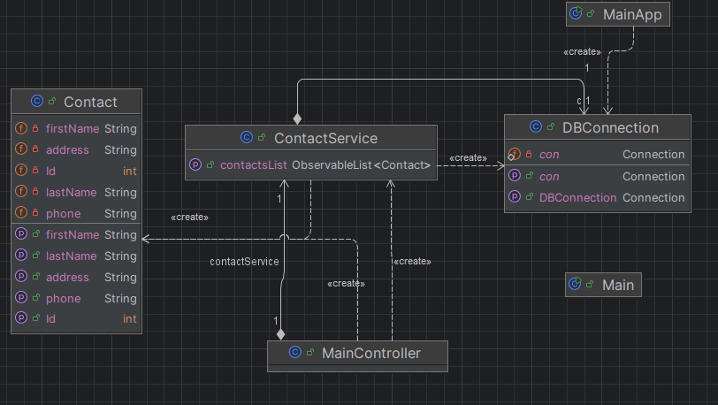
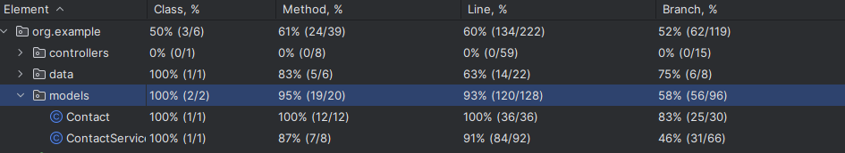
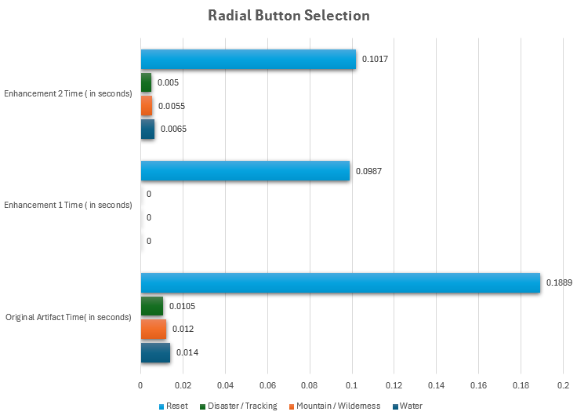

# Computer Science Capstone
## CS-499 | SNHU

## Welcome to My ePortfolio

This portfolio showcases some of the skills and knowledge that I have gained from studying at Southern New Hampshire University (SNHU). This portfolio showcases the growth in my technical abilities by enhancing artifacts that were completed early in my academic career, and enhancing them in three categories, software engineering and design, databases, and algorithms and data structures. Each section will contain milestones that I have completed, with the original and enhanced artifacts located at the end of each section. You can refer to the _Table of Contents_ to quickly navigate the portfolio, and at the end of each section, easily move back to the top of the page using the _Back to Top_ buttons located at the end of each section.

### _Table of Contents_

&nbsp;[Professional Self-Assessment](#self-assessment "Professional Self-Assessment") 
&nbsp;&nbsp;&nbsp;&nbsp;[Code Review](#code-review "Code Review") 
&nbsp;[Software Engineering and Design](#software-engineering-and-design "Software Engineering and Design") 
&nbsp;&nbsp;&nbsp;&nbsp;&nbsp;&nbsp;[View the Code](#artifacts-software-engineering-and-design "Artifacts Software Engineering and Design") 
&nbsp;[Databases](#databases "Databases") 
&nbsp;&nbsp;&nbsp;&nbsp;&nbsp;&nbsp;[View the Code](#artifacts-databases "Artifacts Databases") 
&nbsp;[Algorithms and Data Structures](#algos-and-ds "Algorithms and Data Structures") 
&nbsp;&nbsp;&nbsp;&nbsp;&nbsp;&nbsp;[View the Code](#artifacts-algorithms-and-data-structures "Artifacts Algorithms and Data Structures") 

As I near the completion of my Computer Science program, I reflect on how far I've come since returning to college in 2022 to pursue my bachelor's degree. The foundational engineering principles I have gained throughout this journey will serve as a cornerstone of my career, equipping me with knowledge and skills that I can confidently apply across all facets of my professional work. These core concepts are not only pivotal to my development as a computer scientist but will also guide my approach to future challenges and opportunities in the field.

One of the key strengths I developed during the program is my ability to collaborate in team environments. Working with others has shown me the importance of clear communication, efficient task management, and clearly defined goals. Professionally, I must collaborate using tools such as Jira and Confluence, as well as Git for version control. This includes using tools like GitHub Actions for automating DevOps workflows. This has been essential in ensuring that development processes are streamlined, and issues are addressed proactively. It’s not only what work that I can do, but how I can present this work to management and stakeholders to show off my technical and collaborative abilities. I employed strategies for building collaborative environments that enable diverse audiences to support organizational decision-making in the field of computer science by completing the _Algorithms and Data Structures_ enhancement and presenting the data in easy to understand ways. I also designed, developed, and delivered professional-quality oral, written, and visual communications that are coherent, technically sound, and appropriately adapted to specific audiences and contexts by completing the user interface for the _Database and Software Engineering and Design_ to industry best practices, as well as presenting the data from the experiments from the _Algorithms and Data Structures_ in a coherent and visually appealing format.

In addition to collaboration, my ability to communicate technical concepts to stakeholders has grown substantially. Throughout my projects, I have consistently had to present complex algorithms and system designs in ways that are easily digestible for non-technical audiences. For example, I optimized API usage by reducing unnecessary calls, which not only improved system performance but I was then able to present the data in a more user-friendly format. These experiences helped me refine my ability to bridge the gap between technical and business perspectives, an important skill for anyone. This shows that I designed and evaluated computing solutions that solve a given problem using algorithmic principles and computer science practices and standards appropriate to its solution, while managing the trade-offs involved in design choices by completing _Algorithms and Data Structures_ enhancement.
The program also strengthened my understanding of fundamental computer science concepts, particularly data structures and algorithms. I gained hands-on experience implementing algorithms that optimized system performance and user experience. For instance, the project I referred to earlier involved refining an algorithm to reduce API calls, which resulted in faster data retrieval and more responsive applications. Understanding how to choose the right data structures to achieve these performance gains was critical, as well as the unique trade off of choosing between consuming more memory, or having certain functions take extra time.

In terms of software engineering and design; I demonstrated an ability, to use well-founded and innovative techniques, skills, and tools in computing practices for the purpose of implementing computer solutions that deliver value and accomplish industry-specific goals by completing by completing the _Database and Software Engineering and Design_ enhancements. This project solidified my understanding of full-stack development, from front-end design to back-end database management. By implementing MySQL within the JavaFX application, I ensured that the system had robust data storage capabilities, which could efficiently handle complex queries and transactions. I was able to keep the program loosely coupled such that it is easily extensible. This was accomplished by keeping to the Model View Controller (MVC) design pattern, and ensuring that any change in one of areas would have minimal impact on any other. You can see the graphical user interface in _Figure 1a_ below. This pattern also ensures that you can easily perform integration and unit testing on each particular aspect of the application.

    
    
<em>Figure 1a - Contact Application Screenshot - CS-320 Software Test Automation and QA</em>

Security was another important area of focus during my studies. Through the program, I developed a security mindset that anticipates adversarial exploits in software architecture and designs to expose potential vulnerabilities, mitigate design flaws, and ensure privacy and enhanced security of data and resources by completing the _Database and Software Engineering and Design_ enhancements. I also learned how to safeguard applications by integrating security best practices. Whether it was protecting database connections or implementing secure API calls, my projects emphasized the need for data integrity and secure communication channels. This included implementing prepared statements for any SQL queries and user input validation of the data. I also learned the power of using static tools for dependency checking. Specifically, by attaching a maven plugin, you can scan and have a report for each of your dependencies. This can be included in the Github Actions, and can be configured to run as much as desired.

The artifacts in my ePortfolio represent a broad range of my technical abilities. The JavaFX GUI application showcases my software engineering skills and my ability to build user-friendly interfaces. The MySQL database artifact demonstrates my proficiency in database management and integration. My commitment to creating reusable and extensible code is evident in my application of the MVC pattern. My work on DevOps using GitHub Actions highlights my commitment to maintaining continuous integration and delivery workflows, ensuring that my applications are always up to date and running efficiently. Finally, the algorithms I implemented for the _Algorithms and Data Structures_ enhancement demonstrate an ability to use well-founded and innovative techniques, skills, and tools in computing practices for the purpose of implementing computer solutions that deliver value and accomplish industry-specific goals. 

Throughout the program, I have also demonstrated my ability to explain complex computing principles to non-technical audiences. Whether it was explaining the design and functionality of an algorithm or detailing system architecture, I have consistently made sure that both technical and non-technical stakeholders understood the impact of my work. This skill, I believe, sets me apart from other candidates, as I can navigate both the technical aspects of a project and the interpersonal dynamics of a team or client relationship.
In conclusion, the Computer Science program has provided me with technical expertise, teamwork experience, and a solid foundation for my continued growth as I continue to expand my knowledge. My ePortfolio reflects the broad range of my abilities and serves as a comprehensive showcase of my competence. As I move forward in my career, I am excited to apply these skills in new and challenging environments, confident in my ability to make meaningful contributions to the field.

    <a href="#">
        <button style="font-size: 15px; font-weight: 500; background: #7fb7aa; color: #ff0000; border-radius: 55px; border-style: solid; border-color: #7fb7aa; padding: 5px 5px;">Back to Top</button>
    </a>

The purpose of a code review is to ensure quality and standards are upheld. This is a vital step for imparting knowledge, early bug detection, and improving collaboration on the development team. This is a highly important step in producing quality code. Below, you can watch the code review that I completed before starting on the enhancements that are displayed in this portfolio.

    

<iframe width="560" height="315" src="https://www.youtube.com/embed/WBrN8XKE9ro?si=HCTj1QMMw5N6LwOX" title="YouTube video player" frameborder="0" allow="accelerometer; autoplay; clipboard-write; encrypted-media; gyroscope; picture-in-picture; web-share" referrerpolicy="strict-origin-when-cross-origin" allowfullscreen></iframe>
    

Figure 1b - Code Review of Original Artifacts

    <a href="#">
        <button style="font-size: 15px; font-weight: 500; background: #7fb7aa; color: #ff0000; border-radius: 55px; border-style: solid; border-color: #7fb7aa; padding: 5px 5px;">Back to Top</button>
    </a>

* __For this enhancement I will demonstrate an ability to use well-founded and innovative techniques, skills, and tools in computing practices for the purpose of implementing computer solutions that deliver value and accomplish industry-specific goals__
* __I will show that I have developed a security mindset that anticipates adversarial exploits in software architecture and designs to expose potential vulnerabilities, mitigate design flaws, and ensure privacy and enhanced security of data and resources__

  
This artifact was created using the code from CS-320, a test automation and QA course, that contained only the Contact and ContactService classes with the accompanying tests classes. I designed a graphical user interface (GUI) that would turn the middle services into a full contact application, using Java with JavaFX, CSS, and MySQL. To handle dependencies, and accommodate JavaFX and MySQL, I have added a Maven file to handle dependencies and integrated Github Actions that build the project based on the pom file, will run the unit tests, and then build and package the jar file for download. Please see _Figure 2a_ below for a completed run on Github Actions.

    
    
<em>Figure 2a - Github Actions for Portfolio Enhancement - CS-320 Software Test Automation and QA</em>

With this continuous integration, continuous delivery (CI/CD) pipeline, I showcase my devops skills. While creating the project, I demonstrated an ability to use well-founded and innovative techniques, skills, and tools in computing practices for the purpose of implementing computer solutions that deliver value and accomplish industry-specific goals. I was also able to keep the application loosely coupled, while integrating a CI pipeline to automatically run the tests, and build the finished application. In addition, the user input is validated, secured by my implementation of the database with JDBC and prepared statements. This shows that I have developed a security mindset that anticipates adversarial exploits in software architecture and designs to expose potential vulnerabilities, mitigate design flaws, and ensure privacy and enhanced security of data and resources.  

    
    
<em>Figure 2b - Input Field Validation - CS-320 Software Test Automation and QA</em>

While creating the Github Actions, I was able to start making the beginnings of a CI pipeline and start the process of running the integration tests for regressions that occur when you are making any code changes. This included writing the .yml file and creating the rules that pull requests must pass certain checks. While the application itself is simple, I am able to show my design processes, and best practices from a design, security, and efficiency standpoint. This included keeping following the Model View Controller (MVC) pattern to separate the concerns of the model from the view and the controller (_See Figure 2c for UML Diagram_). This was accomplished by having minimal validity checks on the controller, to only see if a field was empty as shown on _Figure 2b_. If the fields check is completed, then the data is passed to the model, checked again for data validity, and inserted into the database, or if there is an error, have the error surfaced on the View.

    
    
<em>Figure 2c - UML diagram Contact Application - CS-320 Software Test Automation and QA</em>

---

## Milestones Completed

* Completed an MVC application
   * Loosely coupled and easily tested and extensible
   * Followed best practices for seperation of concerns
* Created a Maven file for dependency management

---
### Artifacts Software Engineering and Design 

Databases and Software Engineering and Design [Enhanced](https://github.com/SamWalts/samwalts.github.io/tree/main/Database%20and%20Software%20Engineering%20and%20Design/Enhancement)

Databases and Software Engineering and Design [Original](https://github.com/SamWalts/samwalts.github.io/tree/main/Database%20and%20Software%20Engineering%20and%20Design/Original)

---

    <a href="#">
        <button style="font-size: 15px; font-weight: 500; background: #7fb7aa; color: #ff0000; border-radius: 55px; border-style: solid; border-color: #7fb7aa; padding: 5px 5px;">Back to Top</button>
    </a>

* __I will show that I have developed a security mindset that anticipates adversarial exploits in software architecture and designs to expose potential vulnerabilities, mitigate design flaws, and ensure privacy and enhanced security of data and resources__
* __I will show that I have employed strategies for building collaborative environments that enable diverse audiences to support organizational decision making in the field of computer science__
 
The artifact that I chose for the Database enhancement was the same artifact I chose for the software Design and Engineering. The artifact is based on the SNHU course CS 320, a class which emphasized customer requirements and appropriate unit testing. The original files were a contact service middleware and accompanying unit tests that I enhanced to include a JavaFX graphical user interface and backend database. This enhancement will show the changes that I made to implement the MySQL database with the user interface to create persistent storage. Specifically, the enhancements will include the implementation of the database with the Java Database Connectivity (JDBC). Because the JDBC is such a resource intensive object, it will only be created once, and reused several times using the singleton pattern. The ContactService makes extensive use of the DBConnection class. As such, unit testing and mocking classes were not enough. In order to satisfy testing needs, and ensure that data is correctly stored, the ContactServiceTest class was changed to implement Testcontainers that allow for integration tests using a real database that is run in a Docker image. Using this method I was able to test over 95% of my methods for the models, and a total of 93% of lines for Contact and ContactService classes (_Figure 3a_).

    
    
<em>Figure 3a - Test Coverage Analysis - CS-320 Software Test Automation and QA</em>

The skills that I demonstrate with this enhancement include a full stack capability with the Java language. This includes how to surface errors on the main page, error handling for SQL errors, and how to manage resource intensive operations such as handling the JDBC. I continue to demonstrate an ability to use well-founded and innovative techniques, skills, and tools in computing practices for the purpose of implementing computer solutions that deliver value and accomplish industry-specific goals. This includes utilizing an industry leading database, MySQL. I was able to develop a security mindset that anticipates adversarial exploits in software architecture and designs to expose potential vulnerabilities, mitigate design flaws, and ensure privacy and enhanced security of data and resources. This was enforced by using encapsulation for the program and enforcing the Model View Controller design pattern for safety and security, to create easily extensible software that is well written and well tested.

## List of enhancements performed from the original artifact

1. Created MySQL database with first name, last name, address, phone number, and an id.
1. Implemented a JavaFX GUI for interacting with the contact database.
1. Implemented a table view for showing saved contacts.
1. On click, text fields will automatically populate for easy updating.
1. Changed the Contact and ContactService classes to use DBConnection instead of a HashMap.
1. Implemented Maven for dependency management.
	1. Enforced encapsulation with Model View Controller design pattern.
	1. Updated unit tests to ensure proper testing.
	1. Implemented Mocking for the updated ContactService class.
	1. Using Github Actions, created a CI pipeline for pull and push to Main:
		1. Automatically build based on Maven pom.xml
		1. Run unit tests
		1. Create zip file containing completed JavaFX project

---
### Artifacts Databases

Databases and Software Engineering and Design [Enhancement](https://github.com/SamWalts/samwalts.github.io/tree/main/Database%20and%20Software%20Engineering%20and%20Design/Enhancement)

Databases and Software Engineering and Design [Original](https://github.com/SamWalts/samwalts.github.io/tree/main/Database%20and%20Software%20Engineering%20and%20Design/Original)

---

    <a href="#">
        <button style="font-size: 15px; font-weight: 500; background: #7fb7aa; color: #ff0000; border-radius: 55px; border-style: solid; border-color: #7fb7aa; padding: 5px 5px;">Back to Top</button>
    </a>

# Algorithms and Data Structures

* __I will show that I have employed strategies for building collaborative environments that enable diverse audiences to support organizational decision making in the field of computer science__
* __I will show that I have designed, developed, and delivered professional-quality oral, written, and visual communications that are coherent, technically sound, and appropriately adapted to specific audiences and contexts__
* __I will prove that I have designed and evaluateed computing solutions that solve a given problem using algorithmic principles and computer science practices and standards appropriate to its solution, while managing the trade-offs involved in design choices__

  
The artifact I chose for the algorithms and data structures was the Salvare Search for Rescue Web application, that is run in Jupyter Notebooks. The application aims to connect the rescue organization with dogs that can be trained for different types or rescue operations. It does this using a Jupyter Notebook with a Dash application for the web page layouts, which includes surfacing the spreadsheet of selected animals, a selection of radio buttons for the parameters required for each type of rescue, and a graph to show a breakdown of the different animals. The application uses a python API to interact with a MongoDB backend. Before I was able to enhance the project, I had to create a local instance of the MongoDB with the 10,000 rows of animals. This was due to the instance available during class being spun down after the semester ended. The numbers in the table are an average of 5 tests, with the highest and lowest score removed, and the middle three averaged out.

    
  
<em>Figure 4a - Bar chart of the orginal artifact and two options of enhancements - CS-340 Client/Server Development </em>

A major inefficiency from the original code was that every time there was a need to sort, or filter the Panda’s data frame, the code would make a new API call to the database, pass the database the filtering parameters, then return the data. While running the local instance, the time for each of these calls to complete is shown in _Figure 4a_ in the Original Artifact Time column of _Figure 4b_, and is still very quick. However, with larger datasets, and cloud based systems, this could lead to massive load times, and increased cloud costs due to repeated and unnecessary database calls. The enhancements and experiments I created are designed to showcase the potential time and cost savings of using the dataframes more effeciently. The first enhancement experiment that I made was to use the original data frame and then create cached dataframes by storing the new frame that was filtered from the original into their own seperate dataframes.

| Type of Search        | Original Artifact Time (s) | Enhancement 1 Time (s) | Enhancement 2 Time (s) |
|:----------------------|:---------------------------|:-----------------------|:-----------------------|
| Water                 | 0.0140                     | 0                      | 0.0065                 |
| Mountain / Wilderness | 0.0120                     | 0                      | 0.0055                 |
| Disaster / Tracking   | 0.0105                     | 0                      | 0.0050                 |
| Reset                 | 0.1889                     | 0.0987                 | 0.1017                 |

_Figure 4b - Table of loading times for the Original, Enhancement 1, and Enhancement2, in seconds_

This uses O(n) * (number of additional dataframes) memory and keeps the O(1) time complexity for retrieving the cached dataframes, but creates the copy for instant reference in the application by removing the extra database calls. This is the best option for the user experience, as shown above in the _Figure 4a_ bar Chart, with an essentially instant response time when selecting different types of rescue animals. However, this does cache each of the data frames, and will use extra memory to do so. This is not a problem for smaller data sets, but with every added option, the memory required would rapidly increase. The “Reset” button is the only button that will make a new API call to retrieve the data in the MongoDB database and catch any potential updates. 

## Experiment Synopsis

The time was captured by using the time module in Python, and making a start, and end point inside of the update_dashboard() method, then making a print statement with the elapsed time. I would then select each option and read from the console the time for each. The tests were then run 5 times each, and the result is the _Figure 4a_ table, and _Figure 4b_ bar chart of the average of 5 attempts.
  
| Type of Search        | Original Artifact Time (s) | Enhancement 1 Time (s) | Enhancement 2 Time (s) |
|:----------------------|:---------------------------|:-----------------------|:-----------------------|
| Water                 | 0.0140                     | 0                      | 0.0065                 |
| Mountain / Wilderness | 0.0120                     | 0                      | 0.0055                 |
| Disaster / Tracking   | 0.0105                     | 0                      | 0.0050                 |
| Reset                 | 0.1889                     | 0.0987                 | 0.1017                 |

_Figure 4b - Table of loading times for the Original, Enhancement 1, and Enhancement2, in seconds_

For the second experiment, I decided to create a middle ground that would remove the extra API calls, but not have the downsides of the increased memory usage due to caching every single one of the filtered data frames that enhancement 1 had. This option is enhancement 2, and you can see the the comparison of it in _Figure 4a_ and _Figure 4b_; instead of pre-filtering and storing the different search types in memory, this enhancement creates a data frame by applying the filter to the original data frame when the radio button is pressed. The potential network calls are the same as from enhancement 1, with a new data frame being called only when the “Reset” button is selected, and at the beginning of the program to populate the dashboard. The time complexity when a button is pressed would only be O(n) with O(n) memory usage. You can see the The average time of selecting each button for the second enhancement was 0.026 seconds per filter, and the comparison of enhancement 2 and the original in _Figure 4b_.

    
  
<em>Figure 4a - Bar chart of the orginal artifact and two options of enhancements - CS-340 Client/Server Development </em>

When completing this enhancement, I was able to design and evaluate computing solutions that solve a given problem using algorithmic principles and computer science practices and standards appropriate to its solution while managing the trade-offs involved in design choices. I also was able to create a table and chart with the enhancements that would be of use in measuring the trade-offs of each different algorithm using small amounts of code to potentially have huge cost savings at scale, especially for a cloud based application. This demonstrates an ability to use well-founded and innovative techniques, skills, and tools in computing practices for the purpose of implementing computer solutions that deliver value and accomplish industry-specific goals.

---
### Artifacts Algorithms and Data Structures 

Algorithms and Data Structures [Original](https://github.com/SamWalts/samwalts.github.io/tree/main/Algorithms%20and%20Data%20Structures/Original)

Algorithms and Data Structures [Enhancement](https://github.com/SamWalts/samwalts.github.io/tree/main/Algorithms%20and%20Data%20Structures/Enhancement)

---

    <a href="#">
        <button style="font-size: 15px; font-weight: 500; background: #7fb7aa; color: #ff0000; border-radius: 55px; border-style: solid; border-color: #7fb7aa; padding: 5px 5px;">Back to Top</button>
    </a>

